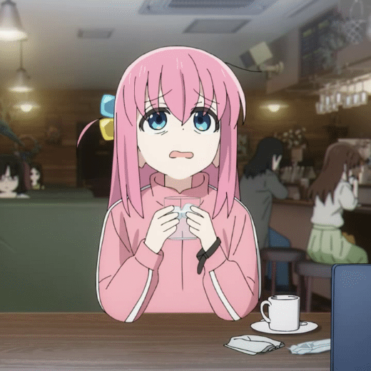

# ☕ If you cannot be a poet, be the poem. 

☎️ Contact zhelonghuang@mail.ustc.edu.cn
  
💻 [Personal Website](https://kirigaya.cn/home)

📖 [Zhihu Page](https://www.zhihu.com/people/can-meng-zhong-de-che-xian/posts)

📺 [BiliBili Page](https://space.bilibili.com/434469188)

⚛️ [Digital-IDE document](https://digital-eda.github.io/DIDE-doc-Cn)

---

### Programming Language

